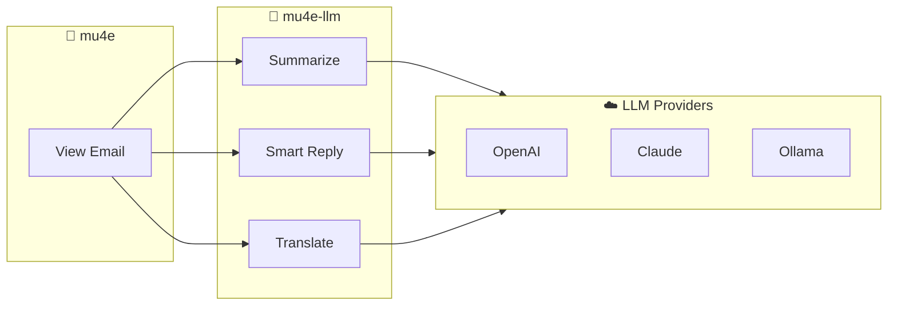
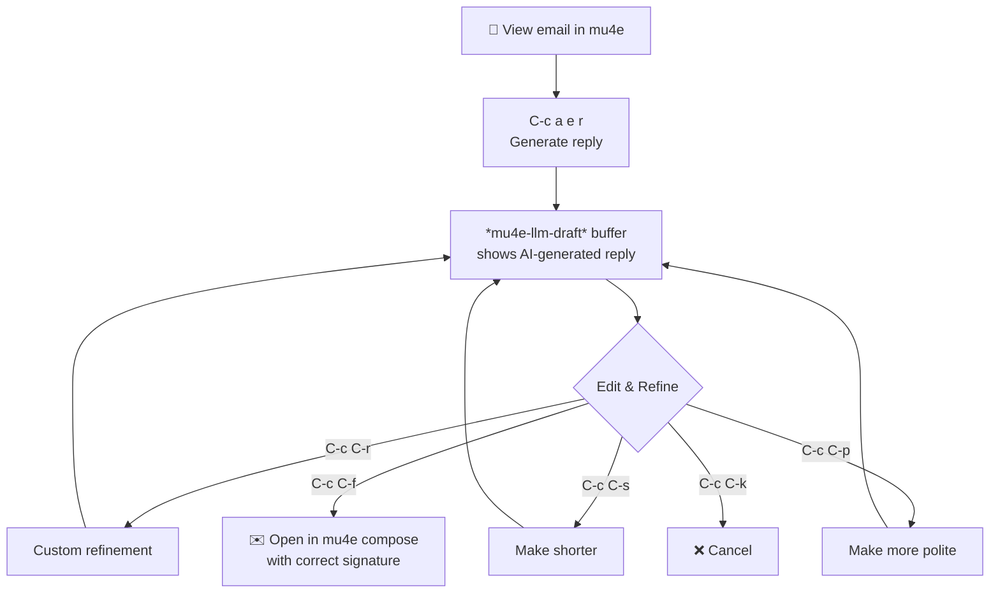

# mu4e-llm

[](https://github.com/sillyfellow/mu4e-llm/actions/workflows/test.yml)
[](https://opensource.org/licenses/MIT)
[](https://www.gnu.org/software/emacs/)

AI-powered email assistance for mu4e using LLM providers via [llm.el](https://github.com/ahyatt/llm).



## Features

- **Thread Summarization**: Get detailed or executive summaries of email threads
- **Smart Reply Drafting**: Generate context-aware email replies with iterative refinement
- **Translation**: Translate messages, threads, or selected text to multiple languages
- **Provider Agnostic**: Works with OpenAI, Claude, Gemini, Ollama, and any llm.el provider
- **org-msg Integration**: Drafts use org-mode syntax for styled HTML emails

## Requirements

- Emacs 28.1+
- [mu4e](https://github.com/djcb/mu) (email client)
- [llm.el](https://github.com/ahyatt/llm) 0.17+ (LLM provider abstraction)
- An LLM provider (OpenAI, Claude, Gemini, Ollama, etc.)

## Installation

### Using straight.el

```elisp
(straight-use-package
 '(mu4e-llm :type git :host github :repo "sillyfellow/mu4e-llm"))
```

### Manual Installation

1. Clone or download this repository to `~/.emacs.d/mu4e-llm/`
2. Add to your init.el:

```elisp
(add-to-list 'load-path "~/.emacs.d/mu4e-llm")
(require 'mu4e-llm)
(with-eval-after-load 'mu4e
  (mu4e-llm-setup))
```

## Quick Start

1. Configure an LLM provider (see [Provider Setup](#provider-setup))
2. Open mu4e and navigate to an email
3. Press `C-c a e s` to summarize the thread
4. Press `C-c a e r` to generate a smart reply

## Commands

### Main Commands (C-c a e prefix)

| Key | Command | Description |
|-----|---------|-------------|
| `s` | `mu4e-llm-summarize` | Generate detailed thread summary |
| `S` | `mu4e-llm-summarize-executive` | Generate brief executive summary |
| `r` | `mu4e-llm-draft-reply` | Generate smart reply draft |
| `R` | `mu4e-llm-draft-refine` | Refine current draft |
| `n` | `mu4e-llm-draft-compose` | Compose new email with AI |
| `t` | `mu4e-llm-translate-message` | Translate current message |
| `T` | `mu4e-llm-translate-thread` | Translate entire thread |
| `a` | `mu4e-llm-abort` | Abort current operation |
| `?` | `mu4e-llm-help` | Show help |

### Draft Buffer Keys

| Key | Command | Description |
|-----|---------|-------------|
| `C-c C-r` | Refine | Refine with custom instruction |
| `C-c C-s` | Shorten | Make draft more concise |
| `C-c C-p` | Polite | Make draft more polite/professional |
| `C-c C-f` | Finalize | Accept draft and open in compose |
| `C-c C-k` | Cancel | Discard draft |

### Workflow Diagrams

#### Smart Reply Workflow



#### Command Map

```mermaid
flowchart TB
    subgraph prefix["C-c a e (mu4e-llm prefix)"]
        direction TB
        s["s → Summarize thread"]
        S["S → Executive summary"]
        r["r → Smart reply"]
        R["R → Refine draft"]
        n["n → New email with AI"]
        t["t → Translate message"]
        T["T → Translate thread"]
        a["a → Abort operation"]
        q["? → Help"]
    end

    subgraph draft["Draft buffer (C-c ...)"]
        direction TB
        cr["C-r → Refine"]
        cs["C-s → Shorten"]
        cp["C-p → Polite"]
        cf["C-f → Finalize"]
        ck["C-k → Cancel"]
    end
```



## Configuration

All options are customizable via `M-x customize-group RET mu4e-llm RET`.

### LLM Provider Settings

```elisp
;; Use a specific provider (overrides fallback)
(setq mu4e-llm-provider (make-llm-openai :key "your-api-key"))

;; Or leave nil and use fallback variable (see Provider Setup)
(setq mu4e-llm-provider nil)
(setq mu4e-llm-provider-fallback-variable 'my/llm-provider)

;; Response creativity (0.0 = focused, 1.0 = creative)
(setq mu4e-llm-temperature 0.7)

;; Maximum response length
(setq mu4e-llm-max-tokens 2048)
```

### Thread Extraction

```elisp
;; Maximum messages to include in thread context
(setq mu4e-llm-max-thread-messages 20)

;; Maximum characters per message body
(setq mu4e-llm-max-message-length 4000)
```

### Caching

```elisp
;; Enable/disable summary caching
(setq mu4e-llm-cache-summaries t)

;; Cache expiry in seconds (default: 1 hour)
(setq mu4e-llm-cache-ttl 3600)

;; Clear cache manually
(mu4e-llm-clear-cache)
```

### Draft Settings

```elisp
;; Default persona style: professional, friendly, formal, concise
(setq mu4e-llm-draft-persona 'professional)

;; Include thread summary in draft buffer
(setq mu4e-llm-draft-include-summary t)
```

### Translation

```elisp
;; Available languages (alist of display-name . code)
(setq mu4e-llm-languages
      '(("English" . "en")
        ("German" . "de")
        ("French" . "fr")
        ("Spanish" . "es")
        ("Japanese" . "ja")
        ("Chinese" . "zh")))

;; Default target language
(setq mu4e-llm-default-target-language "en")
```

### Prompt Customization

All LLM prompts are customizable via `M-x customize-group RET mu4e-llm RET`:

| Variable | Purpose |
|----------|---------|
| `mu4e-llm-summary-standard-prompt` | Standard thread summary |
| `mu4e-llm-summary-executive-prompt` | Executive summary |
| `mu4e-llm-draft-reply-prompt` | Reply drafting |
| `mu4e-llm-draft-refine-prompt` | Draft refinement |
| `mu4e-llm-draft-compose-prompt` | New email composition |
| `mu4e-llm-draft-persona-descriptions` | Persona style definitions |
| `mu4e-llm-translate-message-prompt` | Single message translation |
| `mu4e-llm-translate-thread-prompt` | Thread translation |
| `mu4e-llm-translate-text-prompt` | Text/region translation |

Example customization:

```elisp
;; More detailed summaries
(setq mu4e-llm-summary-standard-prompt
      "Provide an extremely detailed summary of this email thread.
Include every decision, action item, and participant opinion.

EMAIL THREAD:
%s")

;; Custom persona
(add-to-list 'mu4e-llm-draft-persona-descriptions
             '(casual . "Write casually, like texting a friend."))
```

## Provider Setup

### Using a Fallback Variable (Recommended)

If you have a global LLM provider variable, point mu4e-llm to it:

```elisp
;; If you have a global provider variable like my/llm-provider:
(setq mu4e-llm-provider-fallback-variable 'my/llm-provider)

;; Now changing my/llm-provider automatically affects mu4e-llm
```

### Direct Provider Configuration

```elisp
;; OpenAI
(setq mu4e-llm-provider
      (make-llm-openai :key (auth-source-pick-first-password
                              :host "api.openai.com")))

;; Claude
(setq mu4e-llm-provider
      (make-llm-claude :key (auth-source-pick-first-password
                              :host "api.anthropic.com")))

;; Ollama (local)
(setq mu4e-llm-provider
      (make-llm-ollama :chat-model "llama3.1"))
```

## org-msg Integration

mu4e-llm generates drafts in org-mode syntax. If you use [org-msg](https://github.com/jeremy-compostella/org-msg), your drafts will automatically render as styled HTML emails.

Without org-msg, drafts are plain text with org-mode formatting that you can copy to your compose buffer.

## Troubleshooting

### "No LLM provider configured"

Either:
1. Set `mu4e-llm-provider` to an llm.el provider object
2. Set `mu4e-llm-provider-fallback-variable` to point to your global provider variable

### Summaries are stale

Clear the cache with `M-x mu4e-llm-clear-cache` or `C-u M-x mu4e-llm-summarize`.

### Thread extraction incomplete

Try increasing `mu4e-llm-max-thread-messages` or ensure your mu index is up to date with `mu index`.

## License

MIT. See [LICENSE](LICENSE).

## Author

Dr. Sandeep Sadanandan <sillyfellow@whybenormal.org>
