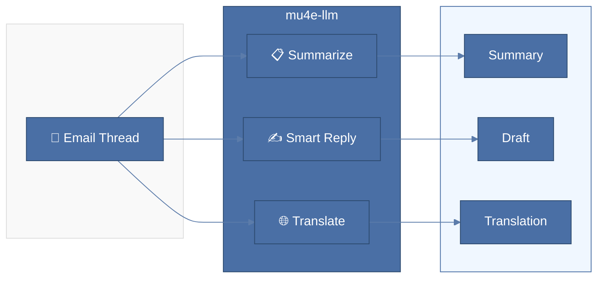
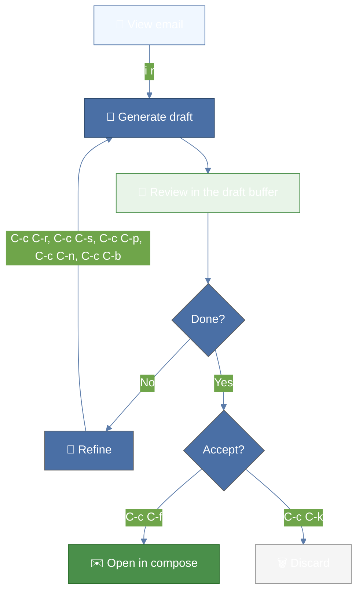
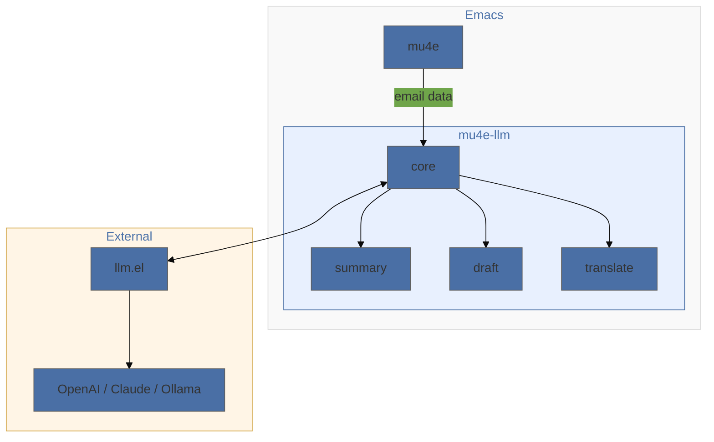

# mu4e-llm

[](https://github.com/sillyfellow/mu4e-llm/actions/workflows/test.yml)
[](https://opensource.org/licenses/MIT)
[](https://www.gnu.org/software/emacs/)

AI-powered email assistance for mu4e using LLM providers via [llm.el](https://github.com/ahyatt/llm).



## Features

- **Thread Summarization**: Get detailed or executive summaries of email threads
- **Smart Reply Drafting**: Generate context-aware email replies with iterative refinement
- **Translation**: Translate messages, threads, or selected text to multiple languages
- **Provider Agnostic**: Works with OpenAI, Claude, Gemini, Ollama, and any llm.el provider
- **org-msg Integration**: Drafts use org-mode syntax for styled HTML emails

## Requirements

- Emacs 28.1+
- [mu4e](https://github.com/djcb/mu) (email client)
- [llm.el](https://github.com/ahyatt/llm) 0.17+ (LLM provider abstraction)
- An LLM provider (OpenAI, Claude, Gemini, Ollama, etc.)

## Installation

### Using straight.el

```elisp
(straight-use-package
 '(mu4e-llm :type git :host github :repo "sillyfellow/mu4e-llm"))
```

### Manual Installation

1. Clone or download this repository to `~/.emacs.d/mu4e-llm/`
2. Add to your init.el:

```elisp
(add-to-list 'load-path "~/.emacs.d/mu4e-llm")
(require 'mu4e-llm)
(with-eval-after-load 'mu4e
  (mu4e-llm-setup))
```

## Quick Start

1. Configure an LLM provider (see [Provider Setup](#provider-setup))
2. Open mu4e and navigate to an email
3. Press `C-c a e s` to summarize the thread
4. Press `C-c a e r` to generate a smart reply

## Commands

### Main Commands (`C-c a e` prefix by default)

| Key | Command | Description |
|-----|---------|-------------|
| `s` | `mu4e-llm-summarize` | Generate detailed thread summary |
| `S` | `mu4e-llm-summarize-executive` | Generate brief executive summary |
| `r` | `mu4e-llm-draft-reply` | Generate smart reply draft |
| `R` | `mu4e-llm-draft-refine` | Refine current draft |
| `n` | `mu4e-llm-draft-compose` | Compose new email with AI |
| `t` | `mu4e-llm-translate-message` | Translate current message |
| `T` | `mu4e-llm-translate-thread` | Translate entire thread |
| `a` | `mu4e-llm-abort` | Abort current operation |
| `?` | `mu4e-llm-help` | Show help |

The prefix is `mu4e-llm-keymap-prefix`. Any key description works, including
a single unmodified key, which suits mu4e because its buffers are modal:

```elisp
(setq mu4e-llm-keymap-prefix "i")   ; then `i s' summarises
```

To hang the commands under a shared prefix map of your own, set
`mu4e-llm-parent-keymap` to the symbol naming it and
`mu4e-llm-parent-keymap-suffix` to the key to use inside it.

### Draft Buffer Keys

| Key | Command | Description |
|-----|---------|-------------|
| `C-c C-r` | Refine | Refine with your own instruction |
| `C-c C-s` | Shorten | Cut it down without losing anything it says |
| `C-c C-p` | Polite | Warmer, without getting longer |
| `C-c C-n` | Plainer | Same meaning, plainer words |
| `C-c C-b` | Bullets | Turn the body into a list |
| `C-c C-t` | Summary | Show or hide the thread summary |
| `C-c C-f` | Finalize | Accept the draft and open a compose buffer |
| `C-c C-k` | Cancel | Discard the draft |

`C-c C-l` still inserts an org link, because drafts are org syntax.

Replies come back as prose. `C-c C-b` is how you ask for bullets on the
emails where a list reads better.

### Workflow Diagrams

#### Smart Reply Workflow



#### Architecture



## Configuration

All options are customizable via `M-x customize-group RET mu4e-llm RET`.

### LLM Provider Settings

```elisp
;; Use a specific provider (overrides fallback)
(setq mu4e-llm-provider (make-llm-openai :key "your-api-key"))

;; Or leave nil and use fallback variable (see Provider Setup)
(setq mu4e-llm-provider nil)
(setq mu4e-llm-provider-fallback-variable 'my/llm-provider)

;; Response creativity (0.0 = focused, 1.0 = creative)
(setq mu4e-llm-temperature 0.7)

;; Maximum response length
(setq mu4e-llm-max-tokens 2048)
```

### Model and Reasoning per Operation

Summarising a thread and drafting a reply want different things. One wants
speed and costs almost nothing; the other is read by a person. Pin a model,
a reasoning level, or both, per operation:

```elisp
(setq mu4e-llm-operation-models
      '((summary           . (:model "gpt-6-luna"  :reasoning "low"))
        (executive-summary . (:model "gpt-6-luna"  :reasoning "low"))
        (translate         . (:model "gpt-6-luna"  :reasoning "low"))
        (draft             . (:model "gpt-6.1-sol" :reasoning "medium"))
        (compose           . (:model "gpt-6.1-sol" :reasoning "medium"))
        (refine            . (:model "gpt-6.1-sol" :reasoning "medium"))))
```

Nothing inherits, so list every operation you want to pin. An operation left
out uses the provider as usual, and the default of nil changes nothing.

`:reasoning` is sent as a `reasoning_effort` request parameter, so its values
are the provider's own. Note that reasoning tokens are billed as output
tokens, which makes a high reasoning level on an expensive model the costly
combination.

### Thread Extraction

```elisp
;; Maximum messages to include in thread context
(setq mu4e-llm-max-thread-messages 20)

;; Maximum characters per message body
(setq mu4e-llm-max-message-length 4000)
```

### Caching

```elisp
;; Enable/disable summary caching
(setq mu4e-llm-cache-summaries t)

;; Cache expiry in seconds (default: 1 hour)
(setq mu4e-llm-cache-ttl 3600)

;; Clear cache manually
(mu4e-llm-clear-cache)
```

### Draft Settings

```elisp
;; Include thread summary in draft buffer
(setq mu4e-llm-draft-include-summary t)
```

### Translation

```elisp
;; Available languages (alist of display-name . code)
(setq mu4e-llm-languages
      '(("English" . "en")
        ("German" . "de")
        ("French" . "fr")
        ("Spanish" . "es")
        ("Japanese" . "ja")
        ("Chinese" . "zh")))

;; Default target language
(setq mu4e-llm-default-target-language "en")
```

### Changing how the AI writes

Every prompt lives in one file, `mu4e-llm-prompts.el`. Nothing else in the
package holds prompt text, so that is the only file to open.

**To change how your email sounds, edit one variable.**
`mu4e-llm-prompt-voice` holds the whole tone instruction. It asks for short
sentences, plain words, a warm and direct register, and prose rather than
lists. It tells the model to answer in the language of the message it replies
to. It also names the openings to avoid. The package sends it as the system
prompt for all three operations that write email, so one edit changes every
one of them.

```elisp
;; A blunter house style
(setq mu4e-llm-prompt-voice
      (concat mu4e-llm-prompt-voice
              "\n\nNever use more than three sentences in a paragraph."))
```

Summaries and translations do not use the voice. They report what someone
else wrote, so writing in your voice would be wrong.

#### The task prompts

Each says what to do, not how to sound.

| Variable | Used for |
|---|---|
| `mu4e-llm-draft-reply-prompt` | Replying to a thread |
| `mu4e-llm-draft-compose-prompt` | Writing a new email |
| `mu4e-llm-draft-refine-prompt` | Every refinement, including the four below |
| `mu4e-llm-draft-shorten-instruction` | `C-c C-s` |
| `mu4e-llm-draft-polite-instruction` | `C-c C-p` |
| `mu4e-llm-draft-plainer-instruction` | `C-c C-n` |
| `mu4e-llm-draft-bullets-instruction` | `C-c C-b` |
| `mu4e-llm-summary-standard-prompt` | `i s`, the detailed summary |
| `mu4e-llm-summary-executive-prompt` | `i S`, the two-line summary |
| `mu4e-llm-translate-message-prompt` | Translating one message |
| `mu4e-llm-translate-thread-prompt` | Translating a thread |
| `mu4e-llm-translate-text-prompt` | Translating a region |

All of them are also reachable through
`M-x customize-group RET mu4e-llm RET`.

#### Placeholders

A prompt marks where the package should drop something in with a letter
after a percent sign. Each prompt's docstring lists the letters it takes;
`C-h v` on the variable shows them.

| | |
|---|---|
| `%t` | the email thread |
| `%d` | the draft you are refining |
| `%i` | the instruction, or what to write about |
| `%n` `%e` | your name, your email address |
| `%l` | the language to translate into |
| `%f` `%u` `%b` | a message's sender, subject, body |
| `%r` | a line naming the recipient |
| `%x` | the text or region to translate |

Order does not matter, and you can leave one out. A letter the package does
not supply stays as it is, rather than breaking the call. To put a real
percent sign in a prompt, write it twice: `%%`.

Two short labels sit alongside the templates:
`mu4e-llm-draft-instructions-label` introduces your extra instructions, and
`mu4e-llm-draft-recipient-label` introduces the recipient. They are here so
that every word the model reads really does live in one file.

```elisp
;; More detailed summaries
(setq mu4e-llm-summary-standard-prompt
      "Summarise this thread in detail. Include every decision, every action
item, and who holds each one.

EMAIL THREAD:
%t")
```

## Provider Setup

### Using a Fallback Variable (Recommended)

If you have a global LLM provider variable, point mu4e-llm to it:

```elisp
;; If you have a global provider variable like my/llm-provider:
(setq mu4e-llm-provider-fallback-variable 'my/llm-provider)

;; Now changing my/llm-provider automatically affects mu4e-llm
```

### Direct Provider Configuration

```elisp
;; OpenAI
(setq mu4e-llm-provider
      (make-llm-openai :key (auth-source-pick-first-password
                              :host "api.openai.com")))

;; Claude
(setq mu4e-llm-provider
      (make-llm-claude :key (auth-source-pick-first-password
                              :host "api.anthropic.com")))

;; Ollama (local)
(setq mu4e-llm-provider
      (make-llm-ollama :chat-model "llama3.1"))
```

## org-msg Integration

mu4e-llm generates drafts in org-mode syntax. If you use [org-msg](https://github.com/jeremy-compostella/org-msg), your drafts will automatically render as styled HTML emails.

Without org-msg, drafts are plain text with org-mode formatting that you can copy to your compose buffer.

## Troubleshooting

### "No LLM provider configured"

Either:
1. Set `mu4e-llm-provider` to an llm.el provider object
2. Set `mu4e-llm-provider-fallback-variable` to point to your global provider variable

### Summaries are stale

Clear the cache with `M-x mu4e-llm-clear-cache` or `C-u M-x mu4e-llm-summarize`.

### Thread extraction incomplete

Try increasing `mu4e-llm-max-thread-messages` or ensure your mu index is up to date with `mu index`.

## License

MIT. See [LICENSE](LICENSE).

## Author

Dr. Sandeep Sadanandan <sillyfellow@whybenormal.org>
